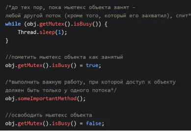

<style>
g { color: #7FFFD4 }
o { color: #FF8C00 }
r { color: #DC143C }
y { color: #BDB76B }
</style>
# Outline
1. Блочные элементы
 + [JVM](#JVM)


# Multithreading
### Многопоточность


<g>Мьютекс</g>

```Java
// Переписать код из блока
```


